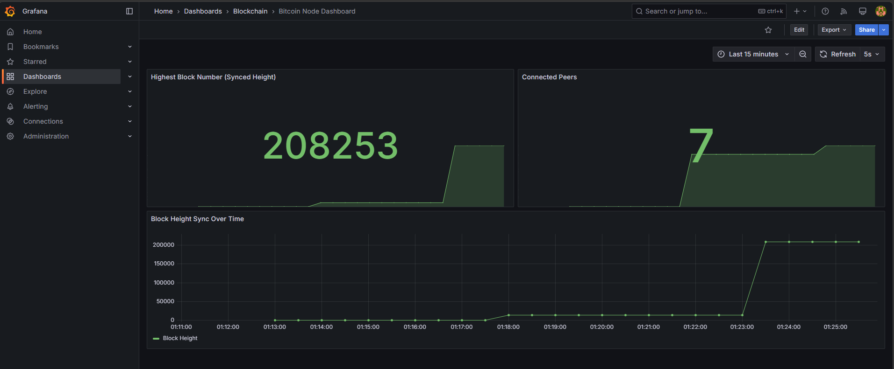
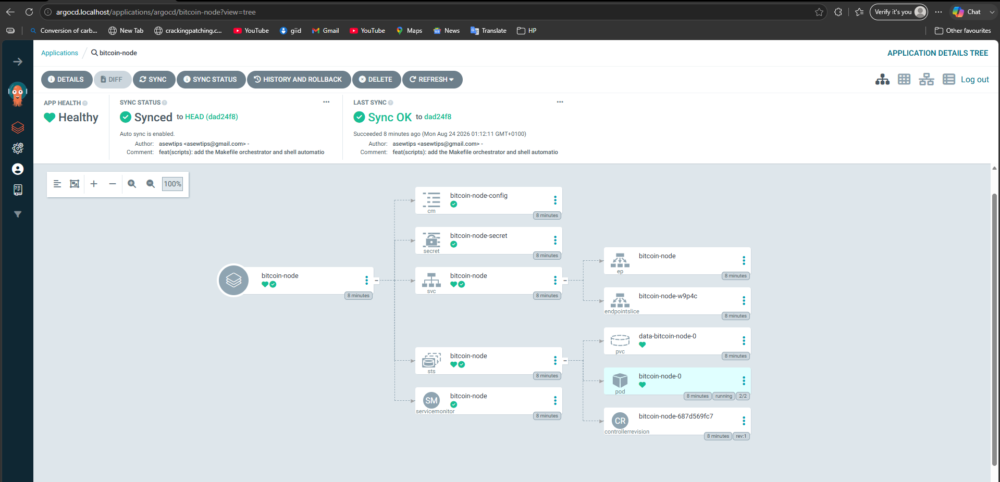

# Bitcoin Core Local Deployment & Observability Platform

A declarative, "one-click" local platform deployment provisioning a synced/syncing Bitcoin Testnet node with full observability via Prometheus and Grafana on a local Kubernetes cluster.

---

## Architecture Overview

This solution provides zero-touch provisioning of a local Kubernetes environment running a containerized, pruned Bitcoin Core (`bitcoind`) node and a companion Prometheus exporter sidecar. Infrastructure and platform services are managed via Terraform, while application workloads follow GitOps principles via ArgoCD.


1. **Bootstrap & Infrastructure Layer (Terraform)**: Deploys a multi-node KinD Kubernetes cluster along with core foundational controllers (`ingress-nginx`, `argo-cd`, `kube-prometheus-stack`).
2. **Delivery Layer (ArgoCD GitOps)**: Reconciles the target application manifests declaratively from Git.
3. **Application Layer (`base-workload` Helm Chart)**: A parameterized chart rendering hardened `StatefulSet` primitives, health probes, non-root security contexts, and headless service discovery.
4. **Observability Layer (Prometheus & Grafana)**: Zero-touch metric collection using Prometheus Operator `ServiceMonitor` CRDs and auto-provisioned Grafana dashboards.

```text
+-----------------------------------------------------------------------------------+
| Host Machine (make up)                                                            |
|                                                                                   |
|  +--------------------+     +--------------------------------------------------+  |
|  | Terraform Engine   | --> | KinD Cluster (v1.31.0)                           |  |
|  +--------------------+     |                                                  |  |
|                             |  +---------------------+  +--------------------+ |  |
|                             |  | Ingress NGINX       |  | ArgoCD Controller  | |  |
|                             |  | (:80 / :443)        |  | (GitOps Engine)    | |  |
|                             |  +----------+----------+  +---------+----------+ |  |
|                             |             |                       |            |  |
|                             |             v                       v            |  |
|                             |  +---------------------+  +--------------------+ |  |
|                             |  | Prometheus & Grafana|  | Bitcoin Core Node  | |  |
|                             |  | (Auto-Provisioned)  |  | StatefulSet (HA)   | |  |
|                             |  +----------+----------+  | - bitcoind (27.0)  | |  |
|                             |             ^             | - exporter (8334)  | |  |
|                             |             |             +---------+----------+ |  |
|                             |             +-- ServiceMonitor -----+            |  |
|                             +--------------------------------------------------+  |
+-----------------------------------------------------------------------------------+

```

##  Prerequisites

Ensure the following tools are installed locally:

* **Docker Engine** (`>= 24.0`)
* **KinD** (`>= 0.23.0`)
* **Terraform** (`>= 1.5.0`)
* **kubectl** (`>= 1.28.0`)
* **Helm** (`>= 3.12.0`)
* **make** & **curl**


##  Quickstart (One-Click Execution)

### Step 1: Deploy Entire Platform
Run the single entry-point command from the root of the repository:
```bash
make up

```

### Step 2: Run Verification Checks

Execute the automated test suite to validate node connectivity, RPC responses, metrics scraping, and UI ingress endpoints:

```bash
make verify

```

### Step 3: Teardown

To cleanly destroy all cluster resources:

```bash
make down

```

---

## Endpoints & Access

Add the following local DNS mappings to `/etc/hosts` if your OS does not automatically resolve `.localhost` domains:

```text
127.0.0.1 grafana.localhost argocd.localhost

```


## Monitored Metrics

The auto-provisioned Grafana dashboard **"Bitcoin Node Dashboard"**  queries the following metrics scraped by the Prometheus Operator:

1. **Highest Block Number (`bitcoin_blocks`)**: Displays the current synced testnet block height.
2. **Connected Peers (`bitcoin_peers`)**: Displays the active count of network peer connections.
3. **Sync Progress Over Time**: Time-series graph tracking continuous block synchronization.

### Visual Evidence & Metrics 

**Grafana Live Metrics Dashboard**


**ArgoCD GitOps Sync Topology**



##  Repository Layout

```text
.
├── Makefile                     # Root orchestrator (make up, down, verify, test)
├── charts/
│   └── app/                     # Reusable parameterized Helm chart (StatefulSet/Deployment)
├── config/
│   ├── application-values.yaml  # Bitcoin node and exporter runtime config
│   ├── argocd-values.yaml       # ArgoCD ingress & server config
│   ├── cluster.yaml             # KinD topology and port mapping definitions
│   ├── ingress-values.yaml      # NGINX ingress controller configuration
│   └── monitoring-values.yaml   # Kube-Prometheus-Stack & auto-provisioned dashboards
├── gitops/
│   └── bitcoin-app.yaml         # ArgoCD Application CRD declaration
├── scripts/
│   ├── down.sh                  # Teardown logic
│   ├── up.sh                    # Orchestration & readiness polling
│   └── verify.sh                # End-to-end automated verification script
└── terraform/
    ├── main.tf                  # Modular IaC orchestrator
    └── modules/                 # Sub-modules: kind, ingress, monitoring, argocd


